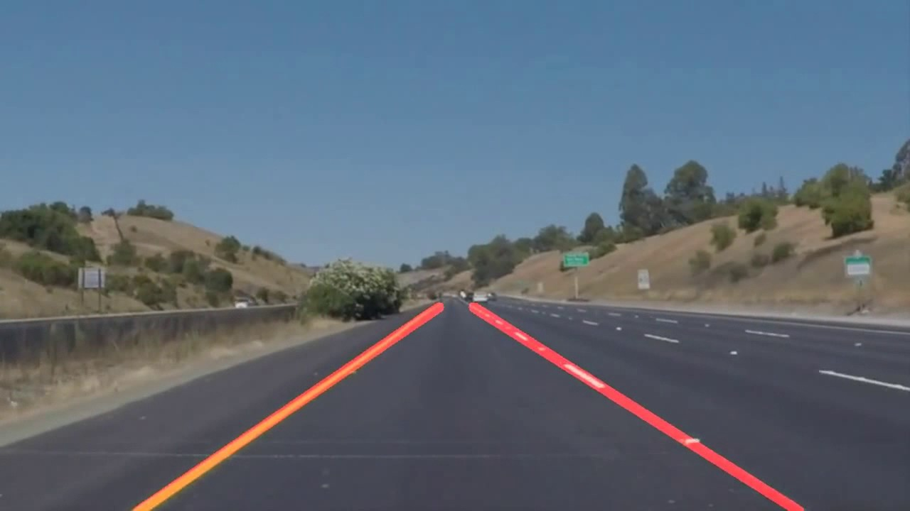
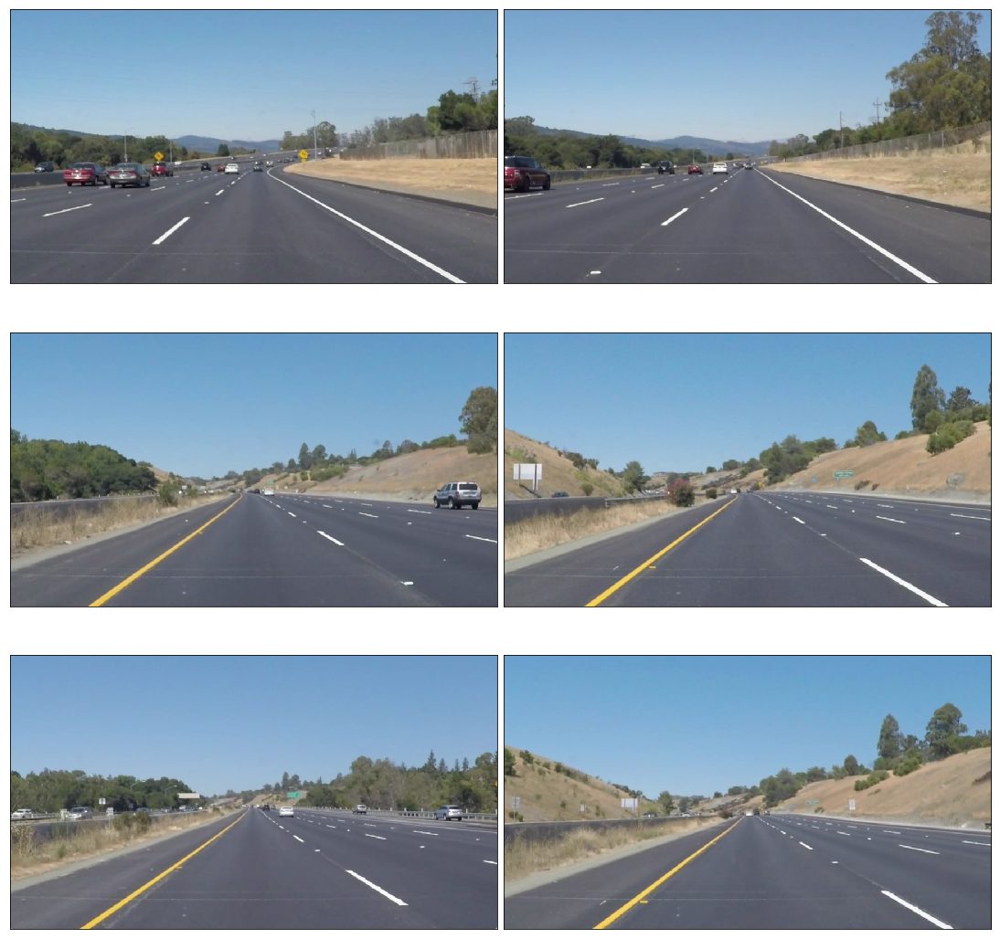
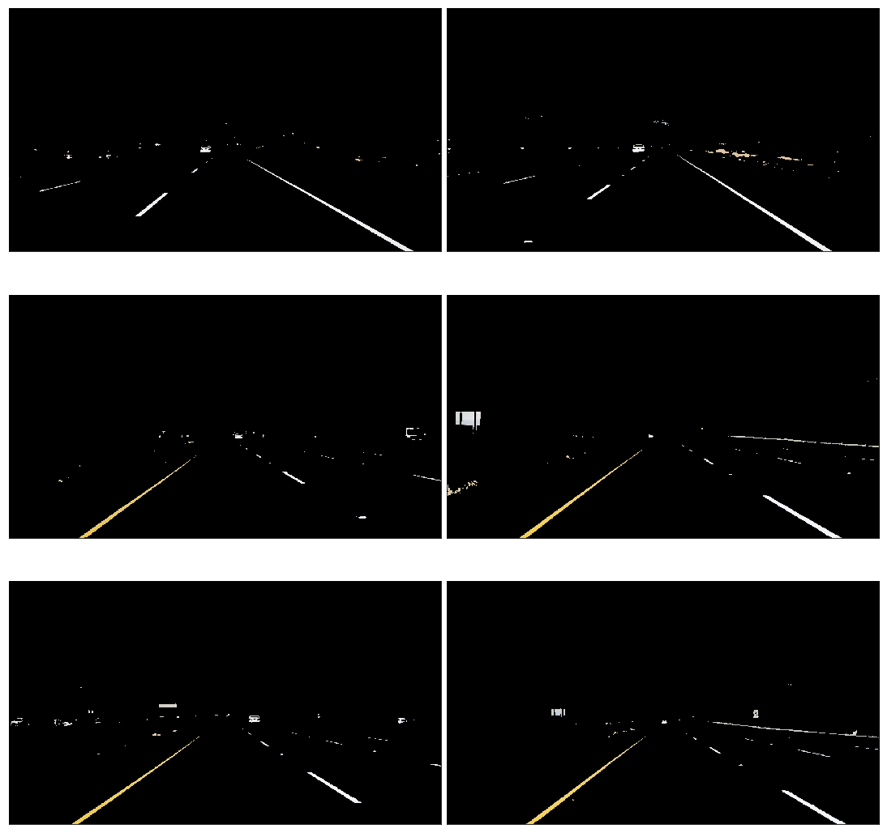
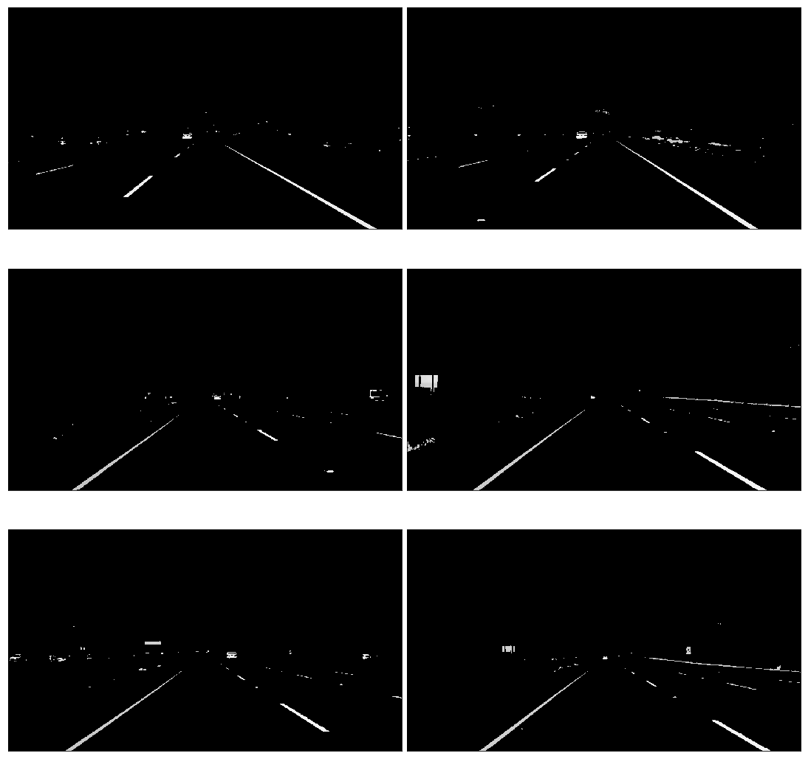
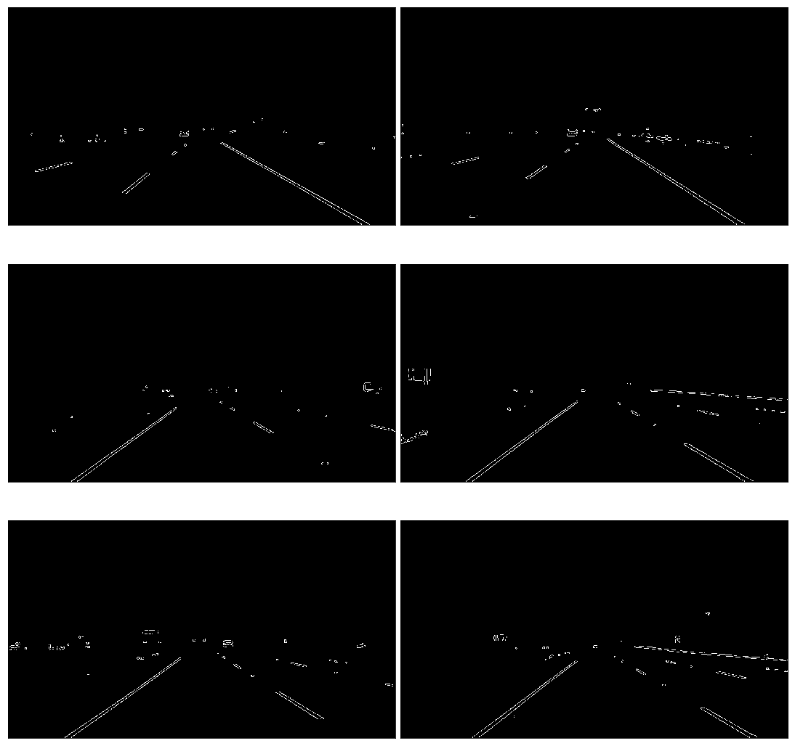
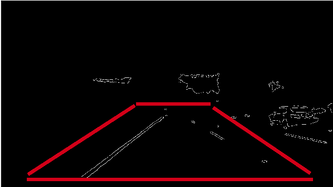
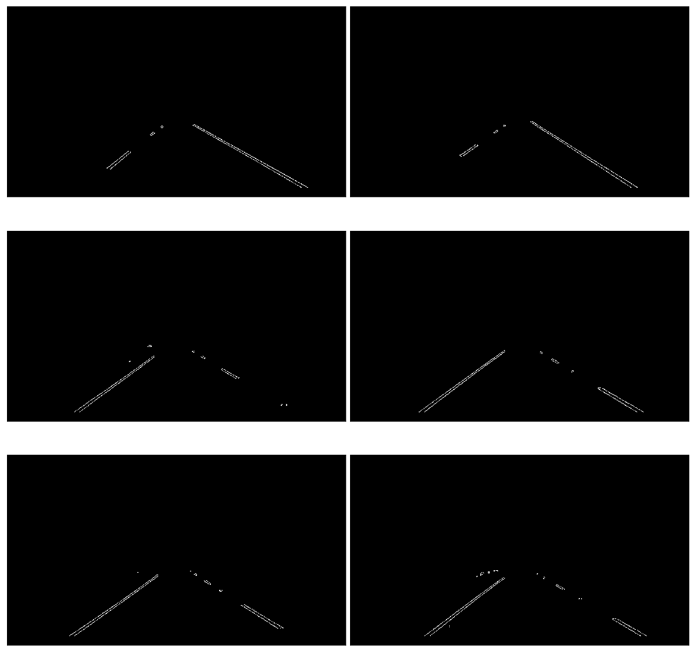
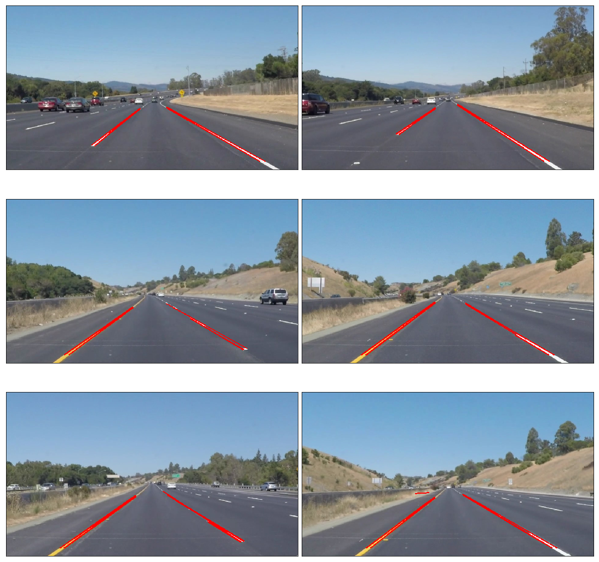
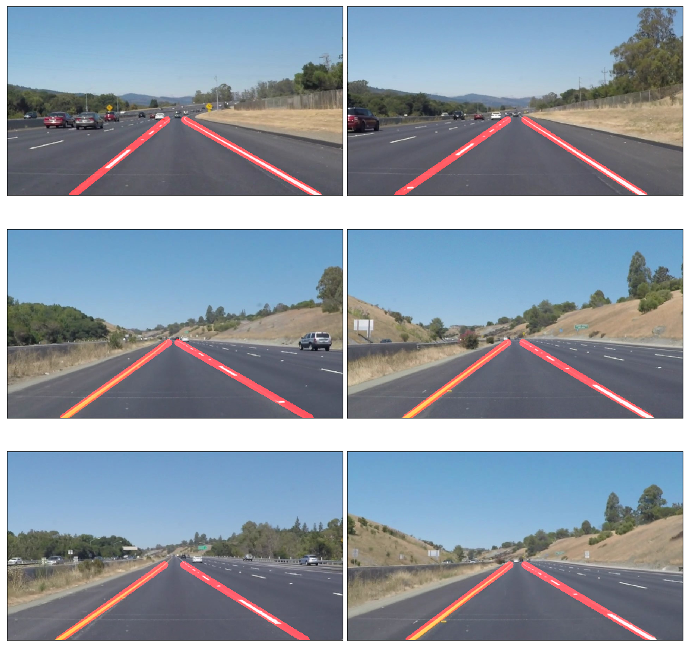

# Finding Lane Lines on the Road
***

this project is the first project of Self-Driving Car Engineer Nano-Degree

In this project, I used Python and OpenCV to find lane lines in the road images.  

The following techniques are used:

- Color Selection
- Canny Edge Detection
- Region of Interest Selection
- Hough Transform Line Detection

Finally, I applied all the techniques to process video clips to find lane lines in them.

## Test Images

Lines are in white or yellow. A white lane is a series of alternating dots and short lines, which we need to detect as one line.

## Color Selection

### RGB Color Space

The images are loaded in RGB color space.  Let's try selecting only yellow and white colors in the images using the RGB channels.

Reference: [RGB Color Code Chart](http://www.rapidtables.com/web/color/RGB_Color.htm)

It looks pretty good 

## Canny Edge Detection

The Canny edge detector was developed by John F. Canny in 1986.  

We want to detect edges in order to find straight lines especially lane lines.  For this, 

- use `cv2.cvtColor` to convert images into gray scale
- use `cv2.GaussianBlur` to smooth out rough edges 
- use `cv2.Canny` to find edges

Let's take a look at each step in details.

Note: [Canny Edge Detection Wikipedia](https://en.wikipedia.org/wiki/Canny_edge_detector) has a good description in good details.

### Gray Scaling

The images should be converted into gray scaled ones in order to detect shapes (edges) in the images.  This is because the Canny edge detection measures the magnitude of pixel intensity changes or gradients (more on this later).

Here, I'm converting the white and yellow line images from the above into gray scale for edge detection.

### Gaussian Smoothing (Gaussian Blur)

When there is an edge (i.e. a line), the pixel intensity changes rapidly (i.e. from 0 to 255) which we want to detect.  But before doing so, we should make the edges smoother.  As you can see,  the above images have many rough edges which causes many noisy edges to be detected.

I use `cv2.GaussianBlur` to smooth out edges.

- [Gaussian Filter OpenCV Theory](http://docs.opencv.org/doc/tutorials/imgproc/gausian_median_blur_bilateral_filter/gausian_median_blur_bilateral_filter.html#gaussian-filter)
- [cv2.GaussianBlur OpenCV API Reference](http://docs.opencv.org/modules/imgproc/doc/filtering.html?highlight=gaussianblur#gaussianblur)

### Edge Detection

`cv2.Canny` takes two threshold values which requires some explanation.

Wikipedia says:

> it is essential to filter out the edge pixel with the weak gradient value and preserve the edge with the high gradient value. Thus two threshold values are set to clarify the different types of edge pixels, one is called high threshold value and the other is called the low threshold value. If the edge pixel’s gradient value is higher than the high threshold value, they are marked as strong edge pixels. If the edge pixel’s gradient value is smaller than the high threshold value and larger than the low threshold value, they are marked as weak edge pixels. If the pixel value is smaller than the low threshold value, they will be suppressed. 

According to the OpenCV documentation, the double thresholds are used as follows:

- If a pixel gradient is higher than the upper threshold, the pixel is accepted as an edge
- If a pixel gradient value is below the lower threshold, then it is rejected.
- If the pixel gradient is between the two thresholds, then it will be accepted only if it is connected to a pixel that is above the upper threshold.
- Canny recommended a upper:lower ratio between 2:1 and 3:1.

These two threshold values are empirically determined.  Basically, you will need to define them by trials and errors.

I first set the `low_threshold` to zero and then adjust the `high_threshold`.   If `high_threshold` is too high, you find no edges.  If `high_threshold` is too low, you find too many edges.  Once you find a good `high_threshold`, adjust the `low_threshold` to discard the weak edges (noises) connected to the strong edges.

- [Canny Edge Detection OpenCV Theory](http://docs.opencv.org/2.4/doc/tutorials/imgproc/imgtrans/canny_detector/canny_detector.html)
- [cv2.Canny OpenCV API Reference](http://docs.opencv.org/doc/tutorials/imgproc/imgtrans/canny_detector/canny_detector.html)

## Region of Interest Selection

When finding lane lines, we don't need to check the sky and the hills.  

Roughly speaking, we are interested in the area surrounded by the red lines below:

So, we exclude outside the region of interest by apply a mask.

Now we have lane lines but we need to recognize them as lines.

## Hough Transform Line Detection

I'm using `cv2.HoughLinesP` to detect lines in the edge images.

There are several parameters you'll need to tweak and tune:

- rho: Distance resolution of the accumulator in pixels.
- theta: Angle resolution of the accumulator in radians.
- threshold: Accumulator threshold parameter. Only those lines are returned that get enough votes (> `threshold`).
- minLineLength: Minimum line length. Line segments shorter than that are rejected.
- maxLineGap: Maximum allowed gap between points on the same line to link them.

More details can be found:

- [Hough Line Transform OpenCV Theory](http://docs.opencv.org/doc/tutorials/imgproc/imgtrans/hough_lines/hough_lines.html)
- [cv.HoughLinesP OpenCV API Reference](http://docs.opencv.org/modules/imgproc/doc/feature_detection.html?highlight=houghlinesp#houghlinesp)

Let's draw the lines onto the original images.  

### Averaging and Extrapolating Lines

There are multiple lines detected for a lane line.  We should come up with an averaged line for that.

Also, some lane lines are only partially recognized.  We should extrapolate the line to cover full lane line length.

We want two lane lines: one for the left and the other for the right.  The left lane should have a positive slope, and the right lane should have a negative slope.  Therefore, we'll collect positive slope lines and negative slope lines separately and take averages.

## Video Clips

I'm drawing lanes on video clips.

[Video Link](https://www.youtube.com/watch?v=Z5hp3urIl7o)

## Conclusion

The project was successful in that the video images clearly show the lane lines are detected properly and lines are very smoothly handled.

It only detects the straight lane lines.  
